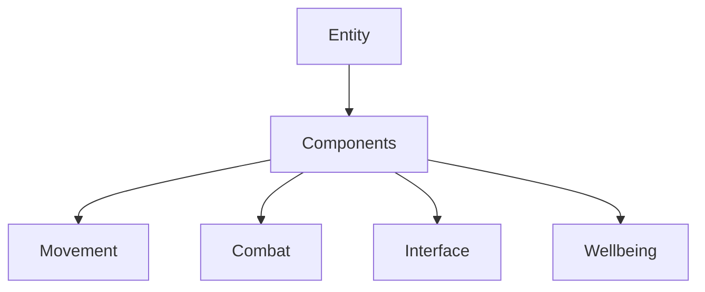
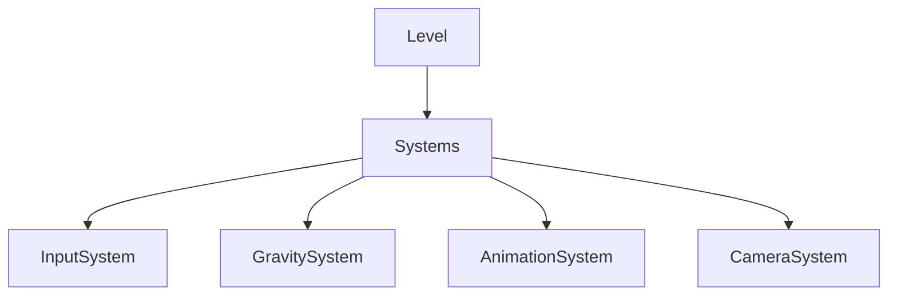
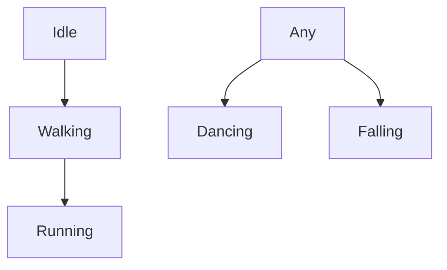

# Astronaut Planet - Professional Implementation Structure

## 1. Core Architecture

### A. Component System


#### 1. Movement Components
- `LocomotionComponent`: Handles character movement and physics
  - Configurable movement strategies
  - Planet surface alignment
  - Movement state management
  - Gravity application

- `RotationComponent`: Manages entity rotation
  - Surface-relative rotation
  - Smooth rotation transitions
  - Target-based rotation

#### 2. Animation Components
- `AnimationComponent`: Manages animation states and transitions
  - Animation state machine
  - Blend tree management
  - Animation event handling

- `ModelComponent`: Handles model visibility and transforms
  - Model switching
  - Transform management
  - Visual state coordination

#### 3. Camera Components
- `CameraComponent`: Controls camera behavior
  - Orbit camera system
  - Collision detection
  - Smooth transitions
  - Input handling

#### 4. Planet Components
- `GravityComponent`: Custom gravity implementation
  - Configurable gravity strength
  - Surface normal calculation
  - Gravity field management

### B. System Architecture

#### 1. Core Systems


- `InputSystem`: Global input management
  - Input mapping
  - Input state tracking
  - Controller support

- `GravitySystem`: Planet-wide gravity management
  - Global gravity settings
  - Multiple gravity source support
  - Physics integration

- `AnimationSystem`: Animation coordination
  - Animation state management
  - Transition handling
  - Event system

- `CameraSystem`: Camera behavior management
  - Camera modes
  - Target tracking
  - Collision handling

### C. State Machine Architecture

#### 1. Player States


- Base States:
  - `PlayerIdleState`
  - `PlayerWalkingState`
  - `PlayerRunningState`
  - `PlayerDancingState`
  - `PlayerFallingState`

#### 2. State Implementation
```gdscript
class_name PlayerStateMachine
extends Node

var current_state: PlayerState
var states: Dictionary = {}

func _ready():
    states = {
        "idle": $States/IdleState,
        "walking": $States/WalkingState,
        "running": $States/RunningState,
        "dancing": $States/DancingState,
        "falling": $States/FallingState
    }
```

## 2. Implementation Details

### A. Component Implementation

#### 1. Locomotion Component
```gdscript
class_name LocomotionComponent
extends Node3D

signal movement_state_changed(state: String)

@export var enabled: bool = true
@export var move_speed: float = 5.0
@export var run_multiplier: float = 2.0
@export var rotation_speed: float = 2.5

var current_strategy: MovementStrategy
var strategies: Dictionary = {}
```

#### 2. Animation Component
```gdscript
class_name AnimationComponent
extends Node

@export var model_component: ModelComponent
@export var locomotion_component: LocomotionComponent

var current_animation: String
var animation_tree: AnimationTree
var state_machine: AnimationNodeStateMachine
```

### B. Resource Structure

#### 1. Movement Resources
```gdscript
class_name MovementAttributes
extends Resource

@export var base_speed: float = 5.0
@export var acceleration: float = 10.0
@export var deceleration: float = 15.0
@export var rotation_speed: float = 2.5
```

#### 2. Animation Resources
```gdscript
class_name AnimationData
extends Resource

@export var animation_name: String
@export var loop_mode: int = 1
@export var blend_time: float = 0.2
@export var speed_scale: float = 1.0
```

### C. Scene Structure
```
Game
├── Level
│   ├── Environment
│   │   ├── Planet
│   │   └── Lighting
│   ├── Systems
│   │   ├── GravitySystem
│   │   ├── InputSystem
│   │   └── CameraSystem
│   └── Entities
│       └── Player
│           ├── Components
│           │   ├── LocomotionComponent
│           │   ├── AnimationComponent
│           │   ├── ModelComponent
│           │   └── GravityComponent
│           ├── States
│           │   ├── IdleState
│           │   ├── WalkingState
│           │   ├── RunningState
│           │   └── DancingState
│           └── Models
│               ├── WalkingModel
│               ├── RunningModel
│               └── DancingModel
```

## 3. System Communication

### A. Signal System
```gdscript
# Component Signals
signal movement_state_changed(state: String)
signal animation_state_changed(state: String)
signal gravity_changed(direction: Vector3, strength: float)
signal surface_aligned(normal: Vector3)

# System Signals
signal input_state_changed(input_data: Dictionary)
signal camera_mode_changed(mode: String)
signal gravity_field_entered(field: GravityField)
```

### B. Resource Management
```gdscript
# Resource Loading
var movement_attributes = preload("res://resources/movement_attributes.tres")
var animation_data = preload("res://resources/animation_data.tres")
var camera_settings = preload("res://resources/camera_settings.tres")
```

## 4. Configuration System

### A. Export Categories
```gdscript
@export_category("Movement")
@export var move_speed: float = 5.0
@export var run_multiplier: float = 2.0
@export var rotation_speed: float = 2.5

@export_category("Animation")
@export var blend_time: float = 0.2
@export var animation_speed: float = 1.0

@export_category("Camera")
@export var camera_sensitivity: float = 0.003
@export var min_angle: float = -80.0
@export var max_angle: float = 80.0
```

### B. Resource Files
```
resources/
├── movement/
│   ├── default_movement.tres
│   └── space_movement.tres
├── animation/
│   ├── walking_data.tres
│   └── running_data.tres
└── camera/
    └── orbit_camera.tres
```

## 5. Debug System

### A. Debug Components
```gdscript
class_name DebugComponent
extends Node

@export var enabled: bool = false
@export var show_vectors: bool = false
@export var show_states: bool = false
```

### B. Debug Visualization
```gdscript
func _draw_debug():
    if not enabled:
        return
        
    if show_vectors:
        draw_movement_vectors()
        draw_gravity_vector()
        
    if show_states:
        update_state_display()
```

## 6. Extension Points

### A. New Components
- Custom gravity fields
- Special movement modes
- Visual effects
- Audio management

### B. New Systems
- Atmosphere system
- Day/night cycle
- Weather effects
- Particle systems

## 7. Testing Structure

### A. Unit Tests
```gdscript
class_name MovementTests
extends GDTest

func test_movement_calculation():
    var component = LocomotionComponent.new()
    var result = component.calculate_movement(Vector2.RIGHT)
    assert_vector3_equals(result, Vector3.RIGHT)
```

### B. Integration Tests
```gdscript
class_name PlayerIntegrationTests
extends GDTest

func test_movement_animation_sync():
    var player = setup_test_player()
    player.move(Vector2.RIGHT)
    assert_eq(player.animation_component.current_state, "walking")
```

This structure provides:
- Clear separation of concerns
- Modular and reusable components
- Centralized system management
- Flexible entity composition
- Efficient state management
- Easy extensibility
- Comprehensive testing support 